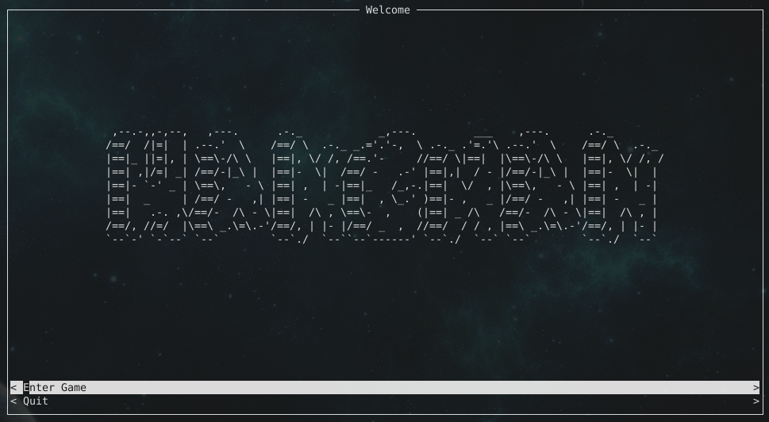
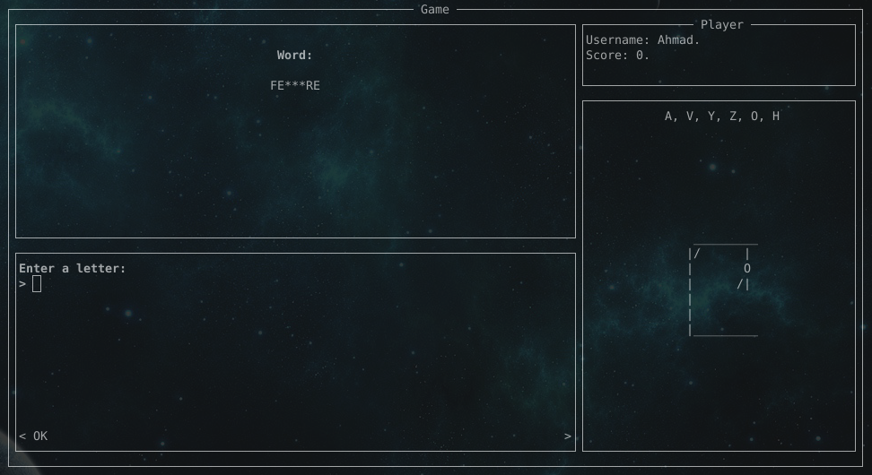

# Hangman
>Note: the words are in french  

This is the classical Hangman Game.  
It is written in Python, and using the Urwid library, to make a complet interface in the Linux terminal.  
Therefore, currently, this game does not work on Windows.   





## Dependencies

This game is written in Python, and it is using the Urwid library. Therefore, to use it, you must have already installed it.  
Otherwise, to install Urwid, you have to run this command:
```
sudo pip install urwid
```

## Running the game

Once you have Urwid installed, you can clone the repository to your computer. You have to run these commands:
```
$ cd
$ git clone https://github.com/ahmadB01/Hangman.git
```
Then, you must obviously use the `python` command to run the game:
```
$ python Hangman/src/
```
    
Thank you :p
